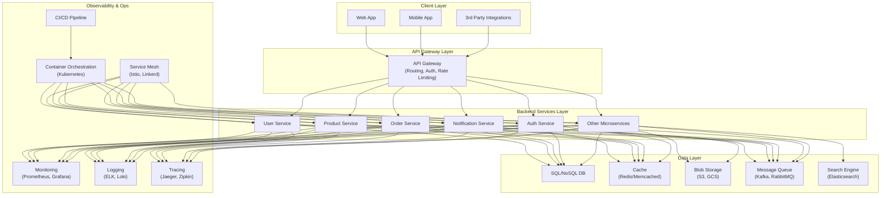
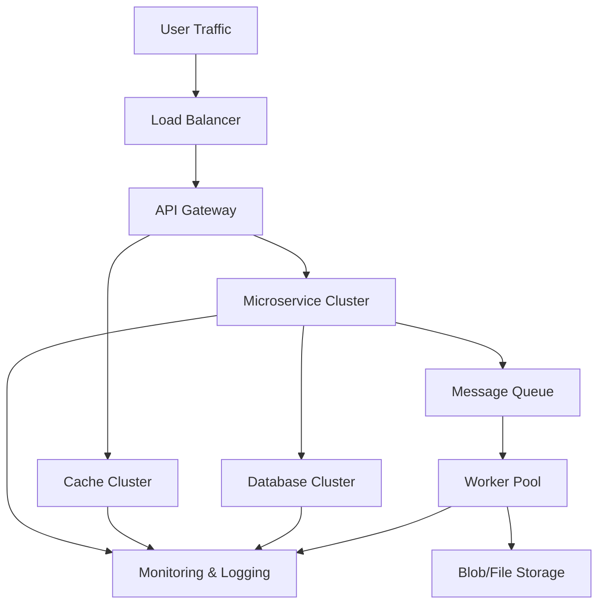
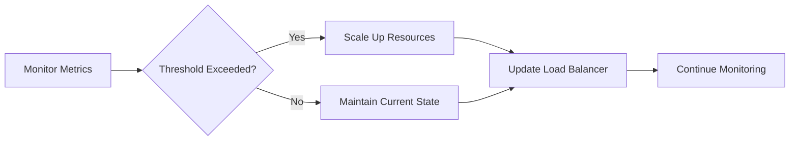

# backend engineering arch.

## Scaling Flows & Diagrams

### High-Level Scaling Workflow

### Auto-Scaling Decision Flow

---

## Recommended Blogs & Resources for Scaling

- [Scaling Your Backend with Microservices](https://martinfowler.com/articles/microservices.html)
- [Best Practices for Caching](https://redis.io/docs/manual/optimization/)
- [Kubernetes Official Documentation](https://kubernetes.io/docs/home/)
- [Celery Distributed Task Queue](https://docs.celeryq.dev/en/stable/)
- [Monitoring with Prometheus](https://prometheus.io/docs/introduction/overview/)
- [How to Scale a Web Application](https://www.digitalocean.com/community/tutorials/how-to-scale-a-web-application)
- [Scaling Databases: Strategies and Best Practices](https://www.cockroachlabs.com/blog/scaling-databases/)
- [Event-Driven Architecture for Scalability](https://aws.amazon.com/architecture/event-driven/)
- [Designing Data-Intensive Applications (Book)](https://dataintensive.net/)

---

## Scaling Summary Flow

1. User traffic is distributed by a load balancer.
2. API Gateway routes requests to appropriate microservices.
3. Microservices use cache and database clusters for fast, reliable data access.
4. Heavy or async tasks are sent to message queues and processed by worker pools.
5. All components are monitored and logged for observability.
6. Auto-scaling is triggered based on real-time metrics.

---

