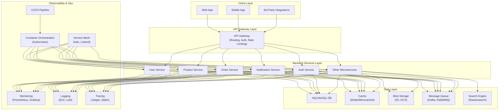

# backend engineering arch.

```mermaid
flowchart TD
  subgraph "Client Layer"
    A1["Web App"]
    A2["Mobile App"]
    A3["3rd Party Integrations"]
  end

  subgraph "API Gateway Layer"
    B1["API Gateway\n(Routing, Auth, Rate Limiting)"]
  end

  subgraph "Backend Services Layer"
    C1["User Service"]
    C2["Product Service"]
    C3["Order Service"]
    C4["Notification Service"]
    C5["Auth Service"]
    C6["Other Microservices"]
  end

  subgraph "Data Layer"
    D1["SQL/NoSQL DB"]
    D2["Cache\n(Redis/Memcached)"]
    D3["Blob Storage\n(S3, GCS)"]
    D4["Message Queue\n(Kafka, RabbitMQ)"]
    D5["Search Engine\n(Elasticsearch)"]
  end

  subgraph "Observability & Ops"
    E1["Monitoring\n(Prometheus, Grafana)"]
    E2["Logging\n(ELK, Loki)"]
    E3["Tracing\n(Jaeger, Zipkin)"]
    E4["CI/CD Pipeline"]
    E5["Container Orchestration\n(Kubernetes)"]
    E6["Service Mesh\n(Istio, Linkerd)"]
  end

  A1 --> B1
  A2 --> B1
  A3 --> B1
  B1 --> C1
  B1 --> C2
  B1 --> C3
  B1 --> C4
  B1 --> C5
  B1 --> C6
  C1 --> D1
  C2 --> D1
  C3 --> D1
  C4 --> D2
  C5 --> D1
  C6 --> D1
  C1 --> D2
  C2 --> D2
  C3 --> D2
  C4 --> D4
  C5 --> D2
  C6 --> D3
  C6 --> D5
  C1 --> D4
  C2 --> D4
  C3 --> D4
  C4 --> D3
  C5 --> D4
  C6 --> D4
  C1 --> E1
  C2 --> E1
  C3 --> E1
  C4 --> E1
  C5 --> E1
  C6 --> E1
  C1 --> E2
  C2 --> E2
  C3 --> E2
  C4 --> E2
  C5 --> E2
  C6 --> E2
  C1 --> E3
  C2 --> E3
  C3 --> E3
  C4 --> E3
  C5 --> E3
  C6 --> E3
  E4 --> E5
  E5 --> C1
  E5 --> C2
  E5 --> C3
  E5 --> C4
  E5 --> C5
  E5 --> C6
  E6 --> C1
  E6 --> C2
  E6 --> C3
  E6 --> C4
  E6 --> C5
  E6 --> C6
```

---

